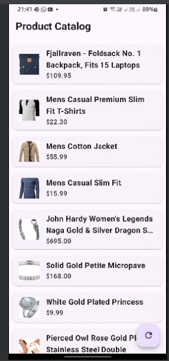

# Guitara Test - Flutter E-Commerce App

## Overview
A Flutter e-commerce app featuring:
- Product catalog from Fake Store API
- Cubit state management
- SQLite offline support
- Material 3 design with deep purple theme

## Features
- 🛒 Product list with images, names & prices
- 🔍 Product details with descriptions
- 🔄 Offline-first architecture
- 🎨 Material 3 UI with smooth animations
- ♻️ Pull-to-refresh functionality

## Technical Architecture

### State Management (Cubit)
```dart
class ProductCubit extends Cubit<ProductState> {
  Future<void> fetchProducts() async {
    emit(state.copyWith(isLoading: true));
    try {
      final products = await _apiService.fetchProducts();
      await _dbService.insertProducts(products);
      emit(state.copyWith(products: products));
    } catch (e) {
      final products = await _dbService.getProducts();
      emit(state.copyWith(
        products: products,
        error: products.isEmpty ? 'Error: $e' : null,
      ));
    }
  }
}
```
# project structure

lib/
├── main.dart                   # App entry point
├── models/
│   └── product.dart            # Product data model
├── services/
│   ├── api_service.dart        # API fetching
│   └── database_service.dart   # SQLite operations
├── cubits/
│   └── product_cubit.dart  
    └── product_state.dart      # State management
├── screens/
│   ├── product_list_screen.dart # Product list UI
│   └── product_detail_screen.dart # Product detail UI
├── widgets/
│   └── product_tile.dart       # Product list item

# dependencies:
- flutter:
- sdk: flutter
- flutter_bloc: ^8.1.3
- http: ^0.13.5
- sqflite: ^2.2.0
- path: ^1.8.2


# Usage
- Product List: View a list of products with images, titles, and prices. Tap a product to see its details.
- Product Details: Displays a larger image, title, price, and description.
- Refresh: Use the floating refresh button to reload products.
- Offline Mode: Products are cached in SQLite for offline access.
# Screenshots



# Screen Video
- https://drive.google.com/file/d/1wp04hObhGd4LdKyRDwz_LAwC2SvCJNCR/view?usp=sharing

# Dependencies
- flutter_bloc: For state management.
- http: For API requests.
- sqflite: For SQLite storage.
- path: For file path handling.